# About Project
## Project Description
We live in a world of Big Data, data so big that sometimes we as humans have trouble finding meaningful patterns within the expanse of information we mine, collate and store. Data driven design / development seeks to create intelligent algorithms and systems that sort, analyse and visualise vast data sets in such a way that make pattern recognition easier. Therefore, this term you will take on the role of a data driven developer, tasked with implementing a real
world data driven web application, using an API of your choice!

## Built with
* React App
* Axios 
* Bootstrap
* Chart.js
* API

# Getting started
## Prepequidites
* HTML and CSS, 
* Fundamentals of JavaScript and ES6, 
* Git and CLI (Command Line Interface), 
* Package Manager (Node + Npm)
* Axios 
* Bootstrap
* Chart.js

## How to install
In the project directory, you can run:
### `npm start`

# Features and Functionality
Shows data that is retrieved from an API and showcases it on the three pages in the form of charts.

# Concept Process
## Ideation
Creating a website that shows data about movies that are pulled from a API.
## Wireframer
<!-- Images-->
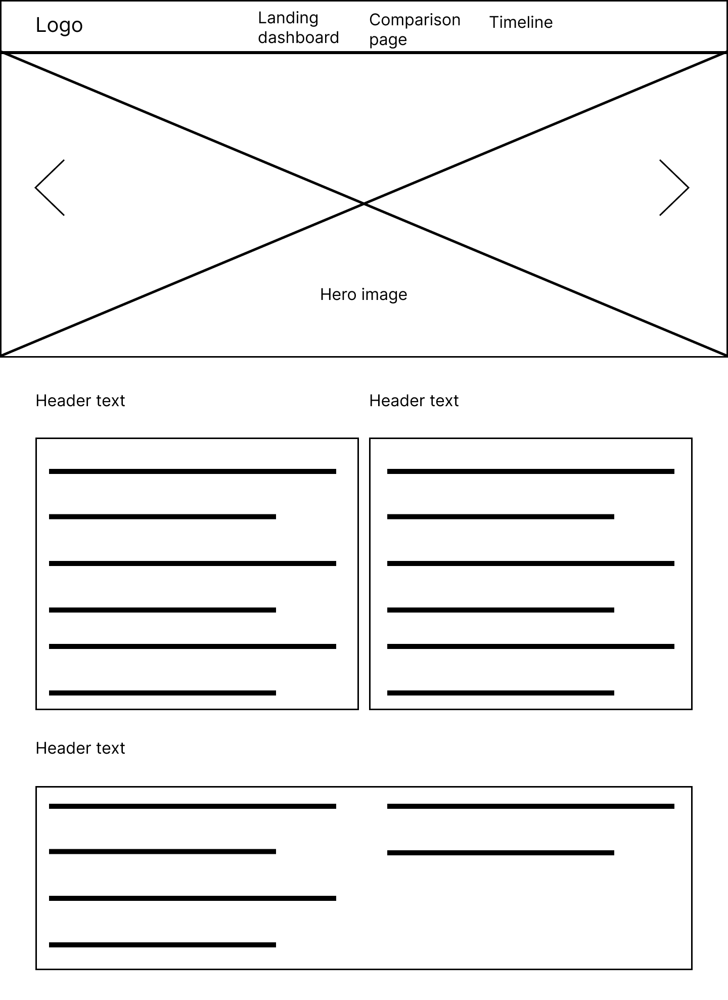
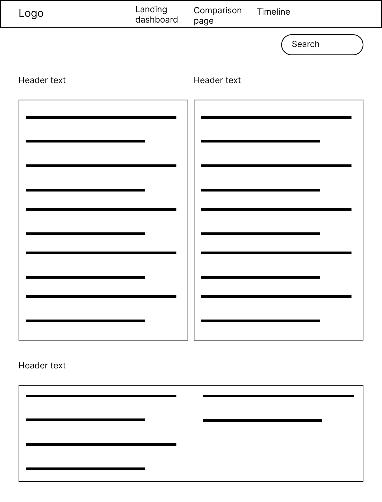
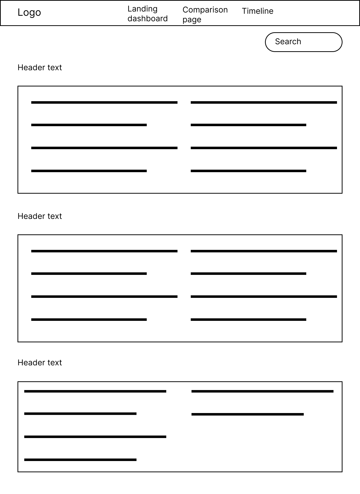

# Development Process
## Implementation Process
Using React app i created a react aplication on which the website will be displayed on. I created three pages namely Landing page, Comapre page and Timeline page. The Landing page holds an about secontion as well a bar chart that i used Chart.js to show date from my API. My compare page has three charts namely a bar chart, radar chart and a pie chart. All three these charts shows diffrent data that can be found on my API. On my timeline page i have a line chart that. The line chart can change to display another set of data on the chart.

### Highlights
Learning how to create a chart using Chart.js, axios and react bootstrap. Then leaening to pull data from a API to show the data on the same charts that was previously made.

### Challenges
When I coded my timeline chart onto onto my timeline page the line chart didn't show all the data. I tried to recode a bar chart on the landing page and the same thing happened. However when i went to code my compare page all the charts were showing the data and working properly.

# Final Outcome
## Mockups
<!-- Images-->
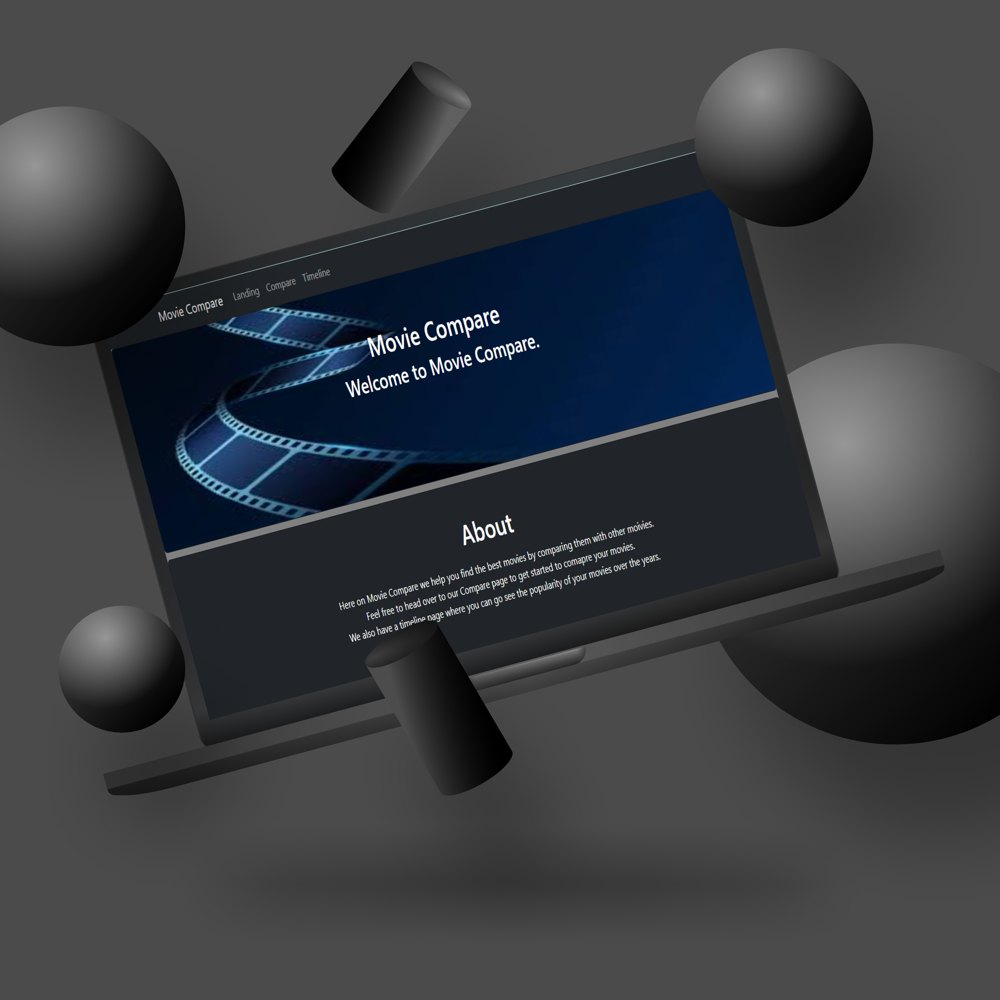
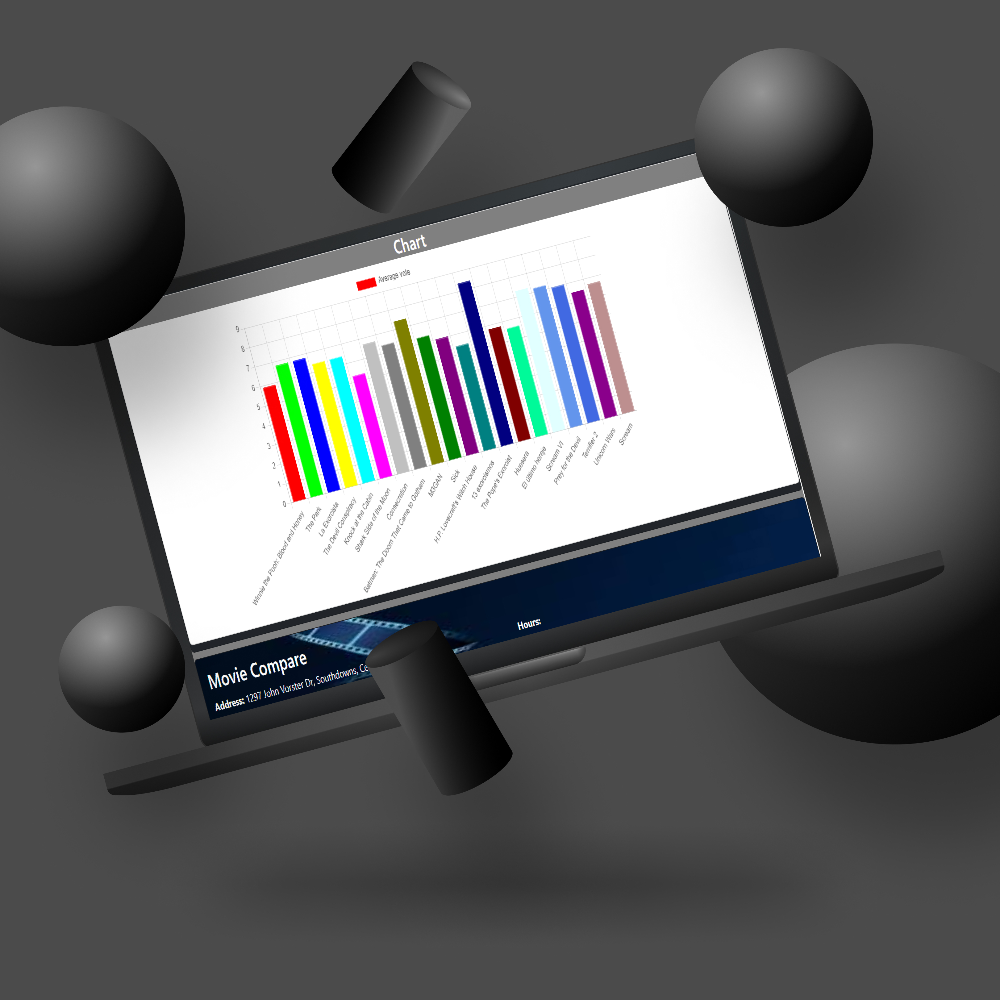
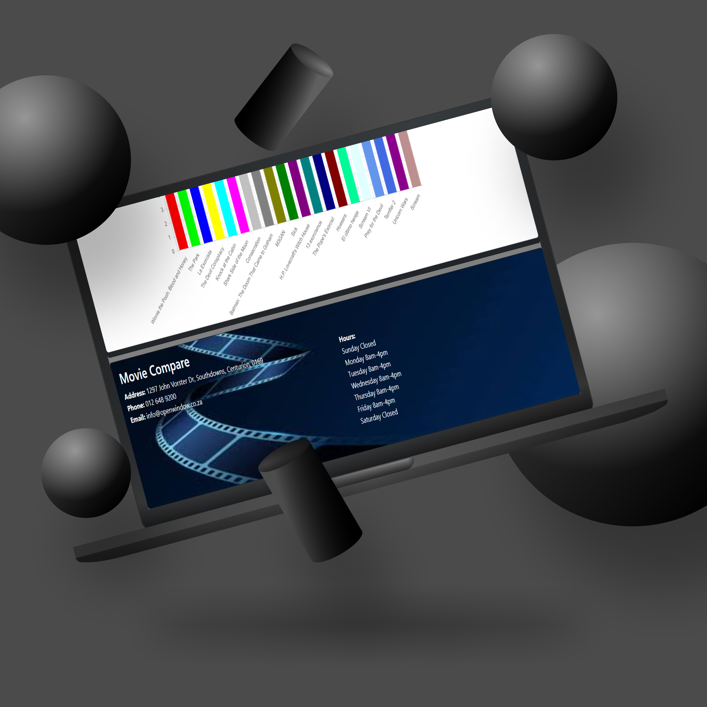
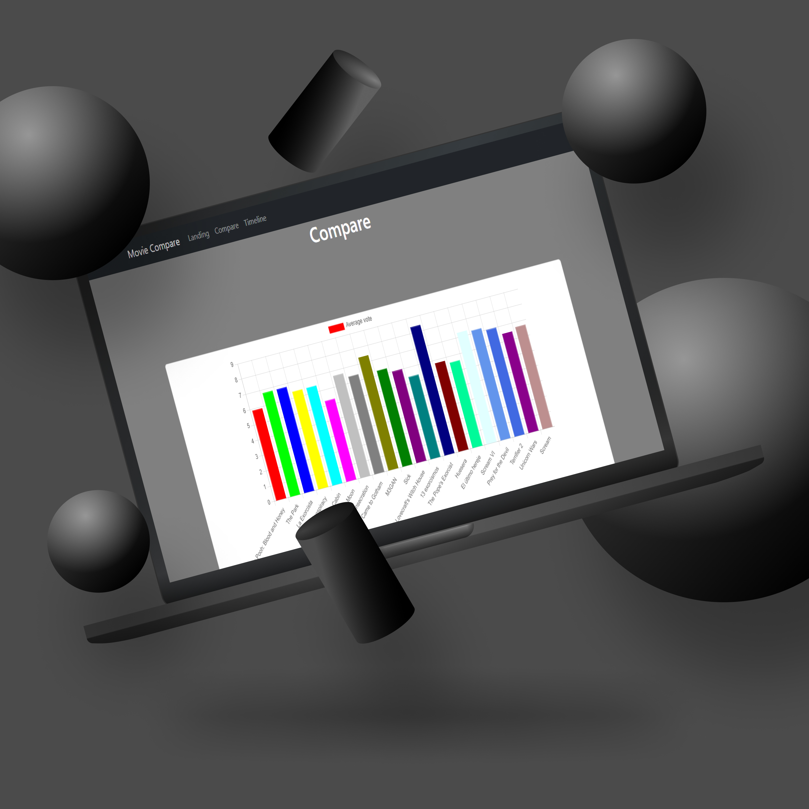
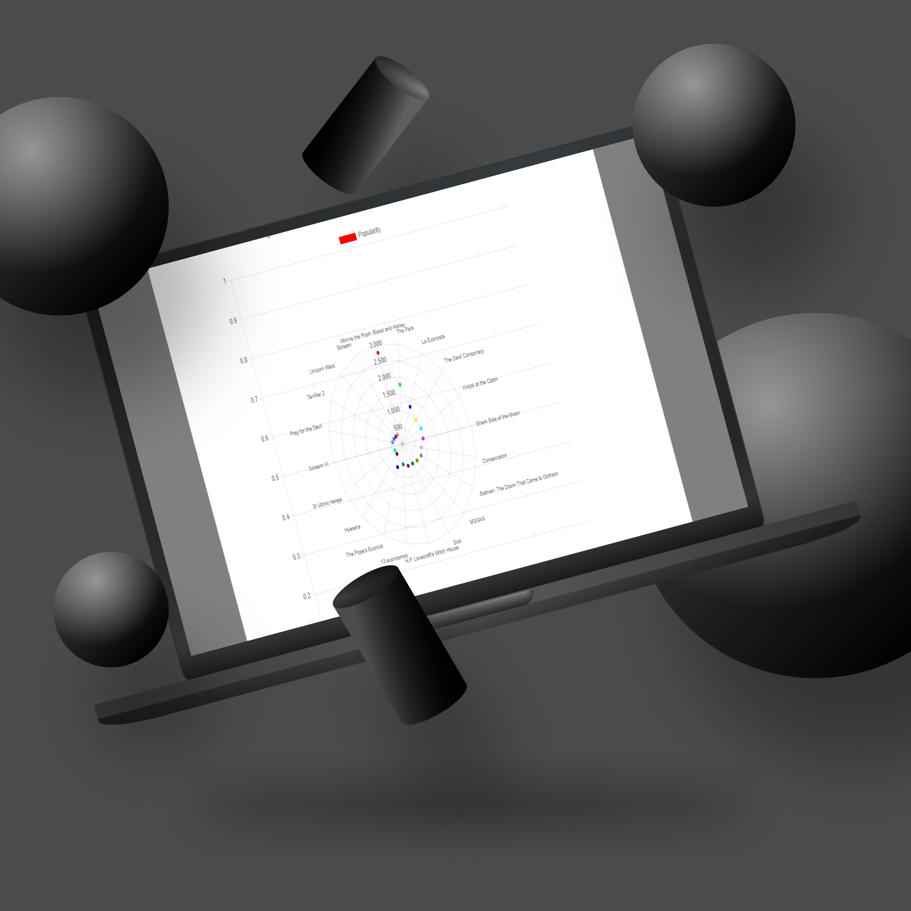
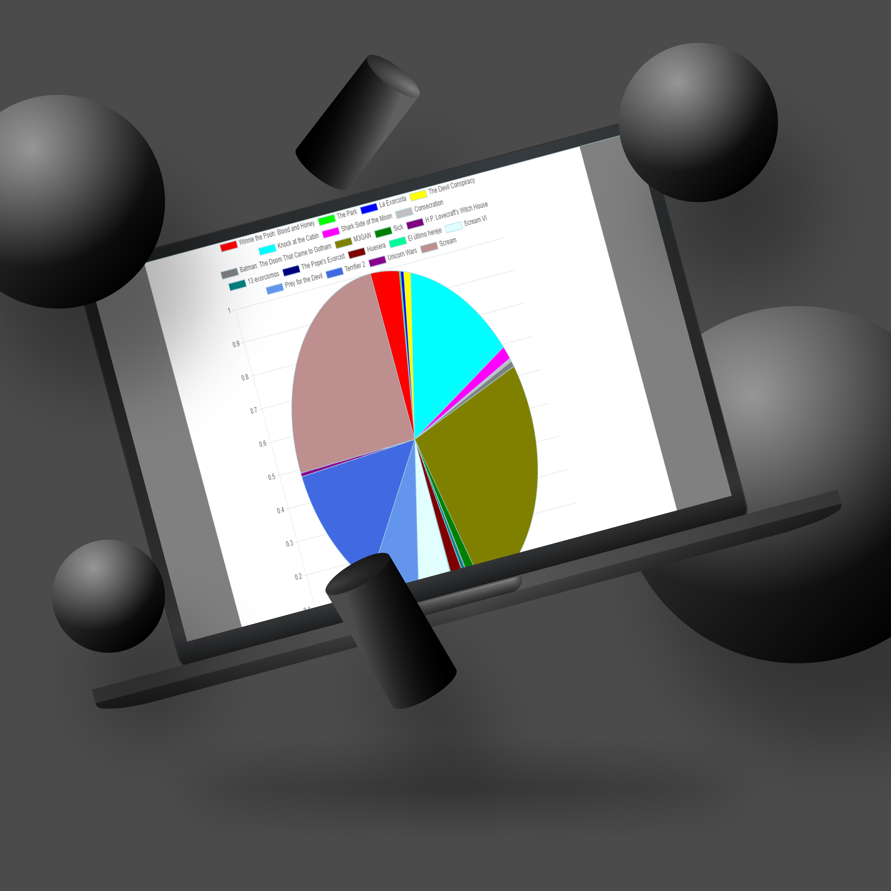
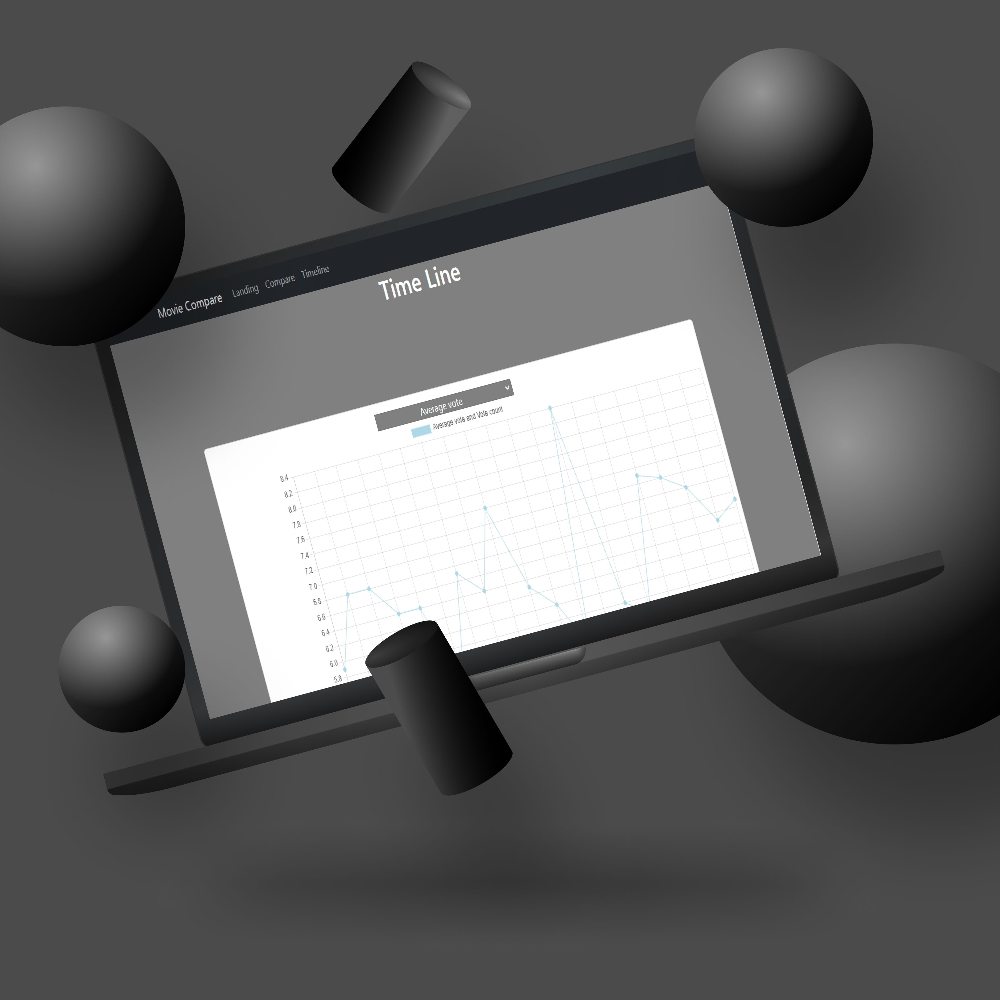
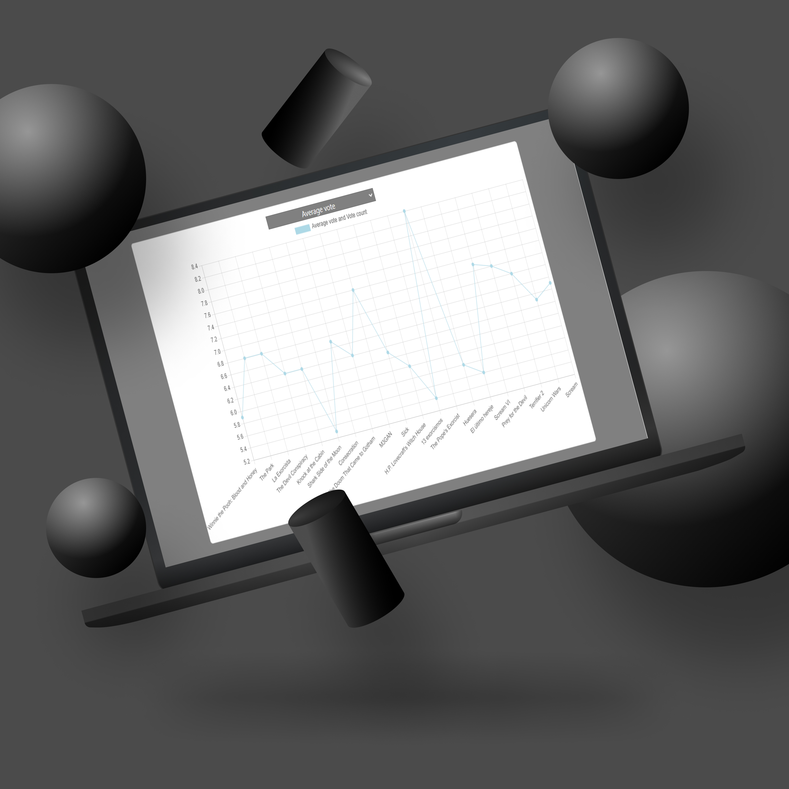

## Video Demonstration
<!-- Video-->

# Conculsion
Taking all of the things i have learned about react, axios, react bootstrap and Chrart.js i have created a website that shows data on charts.
